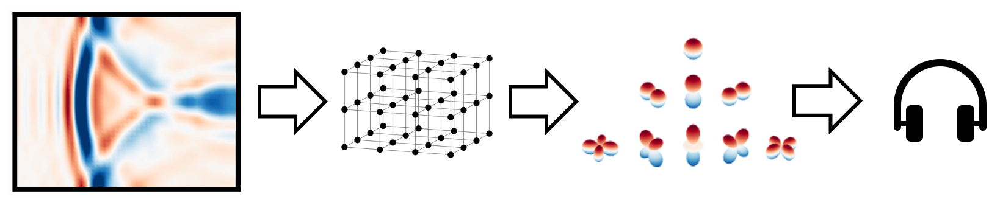
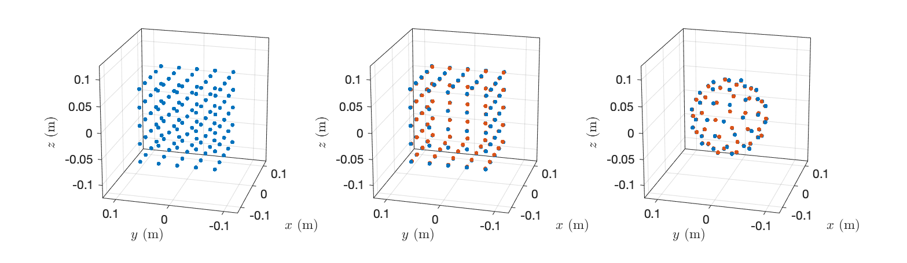

# The Chalmers Auralization Toolbox

## Overview

The Chalmers Auralization Toolbox is a collection of MATLAB scripts that auralize sampled sound fields binaurally. The sound field quantity that is sampled can be either the sound pressure or the combination of sound pressure and particle velocity (or equivalently the sound pressure gradient). The primary purpose is auralization of data simulated with methods like FDTD, FEM, BEM, and the like. The sampled data can be converted to either an ambisonic representation, which can then be rendered in realtime with head tracking with standard ambisonic tools like [SPARTA AmbiBIN](https://leomccormack.github.io/sparta-site/docs/plugins/sparta-suite/#ambibin) or the [BinauralDecoder](https://plugins.iem.at/docs/plugindescriptions/#binauraldecoder) from the IEM Plugin Suite (*ambisonic auralization*, find more details [below](#ambi)). Or, the sampled data can be auralized binaurally without an intermediate format (*direct auralization*).

The following preprint comprises a comprehensive overview of the capabilities of the toolbox:

> J. Ahrens. Perceptually Transparent Binaural Auralization of Simulated Sound Fields. JAES (submitted) [ [pdf](https://arxiv.org/abs/2412.05015) ]

It comprises also a **formal evaluation and validation** of different grid parameters and identified parameter sets that provide perceptually transparent auralization, i.e., an auralization that is perceptually indistinguishable from the ground truth. **Binaural audio examples** that were created with the toolbox are available [here](http://www.ta.chalmers.se/research/audio-technology-group/audio-examples/jaes-2025a/). 

The figure below illustrates the types of sampling grids that can be processed (volumetric, cubical surfaces, and spherical surfaces). 

You will need to download the employed HRIRs of a Neumann KU 100 manikin from [here](https://zenodo.org/record/3928297/files/HRIR_L2702.sofa?download=1) and store them in the subfolder `hrtfs` (The MATLAB script is going to do that automatically for you, both the downloading and creating that folder.) as well as the [SOFA](https://www.sofaconventions.org/mediawiki/index.php/SOFA_(Spatially_Oriented_Format_for_Acoustics)) MATLAB API from [here](https://sourceforge.net/projects/sofacoustics/) and the function `AKfractOctSmooth.m` from [here](https://github.com/f-brinkmann/AKtools/blob/main/2_Tools/Tools/AKfractOctSmooth.m) (either install AKTools or copy the function into the folder `dependencies`. 

The surface grids require either a single layer of both sound pressure and particle velocity or a double layer of sound pressure. When using a double layer of sound pressure, make sure that the distance between the layers is not larger than 5 mm.

The toolbox was originally presented in 

> Jens Ahrens, "A Software Tool for Auralization of Simulated Sound Fields," Auditorium Acoustics, Athens, Greece, 2023 [ [pdf](https://research.chalmers.se/publication/539920/file/539920_Fulltext.pdf) ]

## Quick Start

Perform auralization of example data that we provide (see below) by running the script `perform_auralization.m`. 

Performing your own custom auralization typically comprises the following workflow:

* Define the sampling grid and store it in the required format. See the script `create_sampling_grid.m` for details and examples. Use the script `plot_grid.m` to visualize your grid.
* Compute the auralization matrix (a set of filters) for the chosen grid. Use either of the scripts `compute_auralization_matrix_ambisonics.m` or `compute_auralization_matrix_direct.m` for this.  Note that the computation of a serious auralization matrix is costly and can take a few minutes. Serious auralization matrices for direct auralization may even take hours to compute (for one head orientation...). The computation with the example data that we provide is quick.
* Get some acoustic simulation data for the chosen grid and execute the script `perform_auralization.m` to auralize them with your auralization matrix.

We provide example data that allow you to execute above named scripts out-of-the-box.

The scripts `compute_auralization_matrix_ambisonics.m` and `compute_auralization_matrix_direct.m` will also create figures similar to Fig. 4 in the JAES manuscript so that you can verify the auralization matrix. The script also auralizes example anechoic data using the computed the auralization matrix and stores the binaural signals in audio files.

See the folder `room_data` to learn what format to bring your own simulation data to convert to to auralize them.

## Example Data

In the folder `resources`, we provide example sound field data for a reverberant room with a reverb decay time of around 1 s ("big hall") in the file `resources/sound_field_pv_spherical_surface_big_hall_L81.mat`. The sampling grid is a spherical surface grid with a radius of 70 mm and 81 nodes on a Fliege grid. The matching precomputed auralization matrix is provided the file `auralization_matrices/auralization_matrix_ambisonics_pv_spherical_surface_L81.mat` and performs 7th-order auralization. We chose it because 7th order is the highest that the plugins that we use in the example Reaper project `binaural_rendering.rpp` support (find more details about the Reaper project [below](#ambi)). 

As we documented in (Ahrens, 2024) referenced above, spherical grids in comination with ambisonic auralization are most favorable. Guaranteed perceptual transparency of the auralization requires in the order of 289 points (of pressure and velocity). You may find that the grid with 81 points allows for very reasonable auralization already. My personal favorite is 225 points. The scripts `compute_auralization_matrix_ambisonics.m` and `compute_auralization_matrix_direct.m` compute anechoic binaural audio examples that will allow for you to verify instantly if the result for your parameter choice is as desired.

Note that we provide only very few precomputed auralization matrices in the folder `auralization_matrices` because serious auralization matrices produce file sizes in the order of hundreds of MB and the matched room data even more than that, and we do not want to clog the internet.

The example data are based on measurements of the response of a real room. The example sound field data were computed via the spatial decomposition method as explained in (Ahrens, 2024) referenced above using the scripts from [this repository](https://github.com/AppliedAcousticsChalmers/acoustic-room-responses). You can create your own input data and binaural ground truth to compare against using the scripts `sdm_to_pressure_velocity.m` and `sdm_to_binaural.m` from that repository. Use `create_sampling_grid.m` and `plot_sampling_grid.m` from the present repository to create and plot sampling grids.

You will find information on the input data format in the folder `resources`. We will shortly add example projects for commercial room simulation softwares to demonstrate how their output can be converted to the required input format.

##  Playback With External Software

The output from the ambisonic methods in the Chalmers Auralization Toolbox is in ACN and N3D format and is compatible with standard ambisonic tools like [SPARTA AmbiBIN](https://leomccormack.github.io/sparta-site/docs/plugins/sparta-suite/#ambibin) or the [BinauralDecoder](https://plugins.iem.at/docs/plugindescriptions/#binauraldecoder). See the example [Reaper](https://www.reaper.fm/) project `binaural_rendering.rpp`. Instructions for how to enable a head tracker in Reaper can be found [here](https://github.com/AppliedAcousticsChalmers/ambisonic-encoding).

Our ambisonic signals are designed to be reproduced binaurally with MagLS HRTFs. It is technically possible to reproduce them with loudspeaker arrays, but we have not tested if our equalization is appropriate for that. BinauralDecoder uses MagLS HRTFs by default. I cannot recall off the top of my head which dataset it uses, but it will be great anyway. We provide the exact same MagLS HRTFs that we used in our preceptual validation experiment referenced above in SOFA format in the folder `hrtfs` for the use with binaural renderers that do otherwise not employ MagLS HRTFs.

MagLS was originally proposed in

> C. Schörkhuber, M. Zaunschirm, and R. Höldrich. Binaural Rendering of Ambisonic Signals via Magnitude Least Squares. In Proceedings of DAGA, pages 339–342, Munich, Germany, March 2018.

## Documentation of the Signal Processing

As to our awareness, direct auralization of sound fields sampled along surfaces as well as auralization of sound fields sampled on a cubical surface via ambisonics has not been presented before. [Here](resources/Chalmers_Auralization_Toolbox.pdf), you will find documentation on all employed methods (including the new surface sampling methods) that the Chalmers Auralization Toolbox comprises. 

## Things to Be Aware of

*Note that we have noticed that certain inexpensive headphones can have strong resonances at high frequencies that emphasize spatial aliasing unreasonably much and thereby amplify differences between the auralization and the ground truth. Please be aware of this until we provide further insight into it.*

See the folder `resources` for information on the coordinate system that we employ. The grid coordinates based on which the auralization matrix is computed have to be such that the sampling points are centered around the coordinate origin. That coordinate origin is then the vantage point of the auralization. The direction of the positive x axis is 'straight ahead'.

It was not straightforward to find parameters that allow for perceptually transparent auralization. In particular, it may happen that the auralization is impaired if you use sampling grids of size that is different from our preferred size of 140 mm diameter/edge length. It may require fiddling with regularization and more to get it sorted out. Make sure that you get in touch with us at jens.ahrens@chalmers.se if things behave differently than you were expecting. 

We found it particularly tricky to get satisfactory results from cubical volumetric grids when using ambisonic auralization. Consider playing around with the values of the variable `taps_c_nm` in ``compute_auralization_matrix_ambisonics.m`` in these cases.

We have not studied the requirements for the distance between the layers of a double pressure-layer grid (`_pp_` type data) in detail. In theory, the distance should be as small as possible but larger than 0. Our preliminary results suggest that distances in the order of 5 mm or smaller are uncritical. The accuracy at high frequencies declines gradually for distances larger than that so that is it not clear what exactly a useful threshold can be. As always, use the audio examples that will be computed for each tested case to judge for yourself.

It will not be straightforward to incorporate HRTFs other than those that we are using. But it is possible.

## References

Some parts of the toolbox base on the following publications. Other parts are original contributions. See the Section [Documentation of the Signal Processing](#dsp) for more details.

Auralization of volumetrically sampled sound fields via ambisonics:

> B. Støfringsdal and U.P. Svensson, 'Conversion of Discretely Sampled Sound Field Data to Aualization Formats,' J. Audio. Eng. Soc. 54(5), pp. 380-400 (May 2006)

> J. Sheaffer, M. van Walstijn, B. Rafaely, and K. Kowalczyk, 'Binaural Reproduction of Finite Difference Simulations Using Spherical Array Processing', IEEE/ACM TASLP 23(12), pp. 2125-2135 (Dec. 2015)

Auralization of sound fields sampled on a spherical surface via ambisonics:

> I. Balmages and B. Rafaely, 'Open-sphere designs for spherical microphone arrays,' IEEE TASLP, vol. 15, no. 2, pp. 727– 732 (2007)

Direct auralization of volumetrically sampled sound fields:

> M. A. Poletti and U. P. Svensson, 'Beamforming Synthesis of Binaural Responses From Computer Simulations of Acoustic Spaces,' J. Acoust. Soc. Am. 124, pp. 301–315 (2008)

## License

The content of this repository is licensed under the terms of the MIT license. Please consult the file [LICENSE](LICENSE) for more information about this license.
