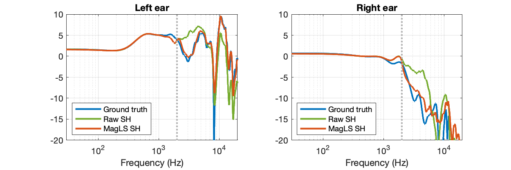

# MagLS HRTFs

Our ambisonic auralization uses MagLS HRTFs, which means that it uses HRTFs that are of limited spherical harmonic order and the coefficients of which were computed using MagLS. The script `compute_magls_hrirs.m` demonstrates how this computation is carried out. The resulting order-limited HRTFs are provided, too. The dataset that we use is the one from

> B. Bernschütz. A Spherical Far Field HRIR/HRTF Compilation of the Neumann KU 100. In Proceedings
of AIA/DAGA, pages 592–595, Meran, Italy, Mar. 2013 [ [data](https://zenodo.org/records/3928297) ].

See a comparison of the original HRTFs (the ground truth) and order-limited HRTFs obtained from a conventional least-squares fit of spherical harmonic (SH) coefficients and from a MagLS fit in the figure below.

MagLS was proposed in

> C. Schörkhuber, M. Zaunschirm, and R. Höldrich. Binaural Rendering of Ambisonic Signals via Magnitude Least Squares. In Proceedings of DAGA, pages 339–342, Munich, Germany, March 2018.

We use [this implementation](https://github.com/thomasdeppisch/eMagLS), which accompanies 

> T. Deppisch, H. Helmholz, and J. Ahrens. End-to-end magnitude least squares binaural rendering of spherical microphone array signals. In Immersive and 3D Audio: From Architecture to Automotive (I3DA), pages 1–7, 2021.

Make sure to invoke `git submodule update --init --recursive` to get all the submodules that comprise this implementation if you would like to create the MagLS HRTFs yourself (you do not need to do that if you only want to use the data).

The `.mat` files in this folder comprise the spherical harmonic coefficients of the MagLS HRTFs, which what our ambisonic auralization process. The [SOFA files](https://www.sofaconventions.org/mediawiki/index.php/SOFA_(Spatially_Oriented_Format_for_Acoustics)) comprise the same HRTFs but as impulse responses per incidence direction. Use these HRTFs with external rendering tools such as [SPARTA AmbiBIN](https://leomccormack.github.io/sparta-site/docs/plugins/sparta-suite/#ambibin) or the like. The `.sofa` files were created with the script `convert_magls_hrirs_to_sofa`.
